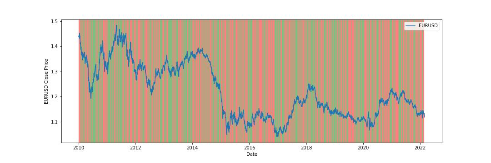

# Hidden Markov Model for EURUSD

This is an implementation of a Hidden Markov Model (HMM) for EURUSD using the yfinance library. The model predicts two hidden states, one for when the price goes up and one for when the price goes down, based on the daily close price of EURUSD from January 1st, 2010 to March 1st, 2022.

EURUSD is the currency pair for Euro and US dollar, which is one of the most heavily traded currency pairs in the foreign exchange market. The market is known for its volatility and sensitivity to various economic and political events happening around the world. Therefore, predicting the price of EURUSD accurately can be a challenging task, and many traders and investors use various tools and techniques to make informed decisions.

One such technique is the Hidden Markov Model, which is a statistical model that can be used to model and predict sequences of data. In the case of EURUSD, we can use HMM to model the daily close price of EURUSD and predict the hidden states that correspond to whether the price went up or down.

The HMM for EURUSD implemented in this project uses the yfinance library to download the daily close price data for EURUSD from January 1st, 2010 to March 1st, 2022. Then, it generates an observation sequence based on the change in price between consecutive days, with a value of 1 indicating that the price went up and a value of 0 indicating that the price went down.

---

## Getting Started
To run the model, you'll need to have Python 3 installed, as well as the following libraries:

- yfinance
- numpy
- hmmlearn
- matplotlib (for visualization)

You can install these libraries using pip by running:

    pip install yfinance numpy hmmlearn matplotlib
   
---

The yf.download() function from yfinance is used to download the EURUSD data from Yahoo Finance, which is then passed to the generate_sequence() function. This function generates an observation sequence based on the change in price between consecutive days, with a value of 1 indicating that the price went up and a value of 0 indicating that the price went down.

Next, the GaussianHMM class from the hmmlearn library is used to define the HMM model with 2 hidden states and a full covariance type. The model is then trained on the generated observation sequence using the fit() method.

The predict() method is used to predict the hidden states for the entire sequence, which are then visualized using the matplotlib library. The EURUSD close price is plotted along with the predicted hidden states, with each state represented by a shaded region of a different color.

The resulting visualization can be used to analyze patterns and trends in the EURUSD close price and identify periods of stability or volatility in the market.

--- 

The chart shows the daily close price of EURUSD from January 1st, 2010 to March 1st, 2022, overlaid with the predicted hidden states. Each hidden state is represented by a shaded region of a different color.

The shaded regions help to identify periods where the model predicts a particular hidden state, which corresponds to whether the price went up or down on that day. For example, if the model predicts a hidden state of "price up" on a particular day, the shaded region for that day will be a particular color (e.g., green).

The visualization can be used to identify patterns and trends in the EURUSD close price and to see if the model's predicted hidden states match these patterns. For example, if the EURUSD close price is consistently increasing over time, we would expect the model to predict more "price up" hidden states, which would be reflected in the visualization as a greater proportion of green shaded regions. Conversely, if the EURUSD close price is consistently decreasing over time, we would expect the model to predict more "price down" hidden states, which would be reflected in the visualization as a greater proportion of red shaded regions.

Overall, the plot can be a useful tool for visualizing the predictions of the HMM model and understanding the underlying patterns in the EURUSD close price.

---

## Modifying the Model

You can modify the model by changing the number of hidden states or the covariance type used in the GaussianHMM constructor. You can also modify the function used to generate the observation sequence by changing the criteria for when the price goes up or down.
